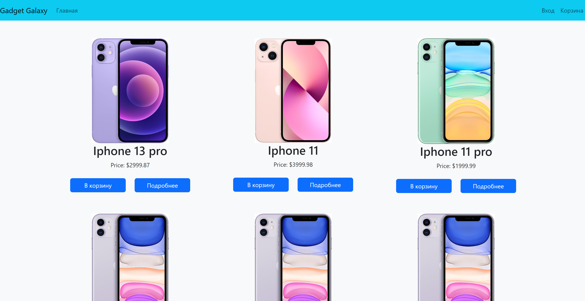
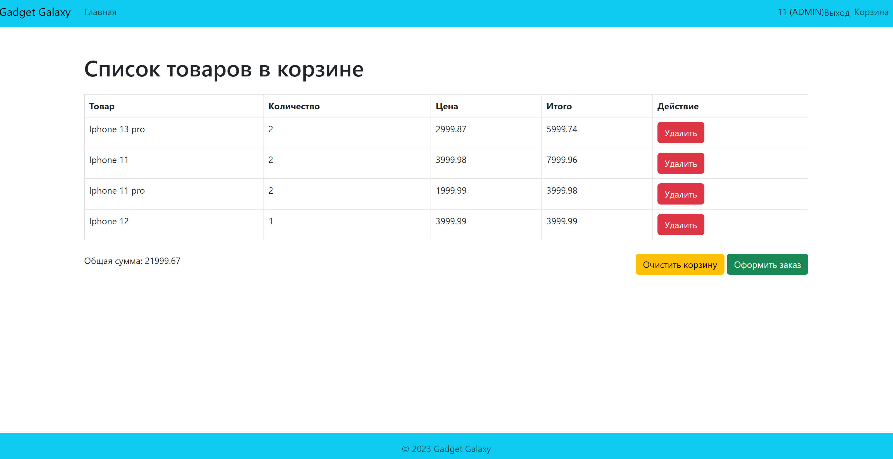

# GadgetGalaxy-OnlineStore

## Introduction
GadgetGalaxy is an e-commerce web application developed as part of a diploma project. This application serves as an MVP demonstrating core online store functionalities including product browsing, cart management, and order processing.

## Screenshots

### Main Interface

### Registration

### Cart

## Key Features
- User registration and authentication
- Product catalog browsing
- Adding products to the shopping cart
- Order placement
- Product catalog management (for administrators)
- Order processing (for administrators)
- User profile editing (for administrators)

## Database Structure
The application utilizes a relational database with the following main entities: Users, Products, Orders, and Shopping Cart. Here's a description of the relationships among these entities:

- **User:** Each user has a unique ID. A user can place multiple orders, but each order belongs to only one user.
- **Product:** Each product has a unique ID. A product can be included in multiple cart items, but each cart item pertains to only one product.
- **Order:** Each order has a unique ID. An order can contain multiple cart items.
- **Cart Item:** Each cart item has a unique ID. A cart item pertains to one order and one product.

## Technologies
This project was built using the following technologies:
- Spring Boot
- Spring Security
- MySQL
- Hibernate
- Thymeleaf

## Future Improvements
- Addition of a product recommendation system
- Integration with social networks for authentication and registration
- Optimization for mobile devices

## Conclusion
This project has allowed me to gain hands-on experience with a multitude of current technologies and acquire practical skills in IT project implementation. Thank you for your attention! Feel free to reach out if you have any questions.
